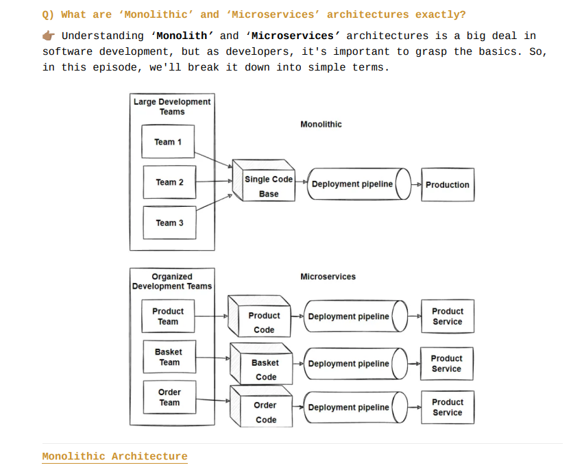
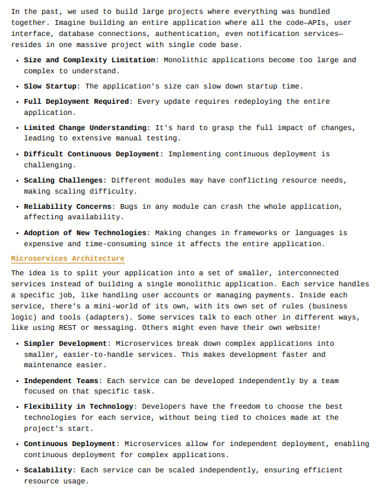
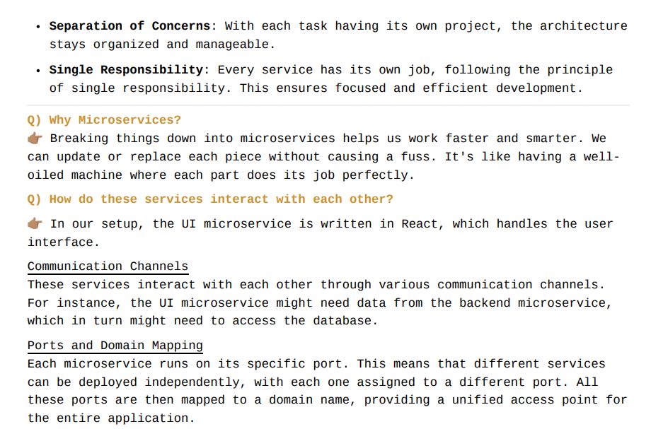

# Namaste React

## Episode - 01 | Inception

### Q1: What is Emmet?

**A:** Emmet is a shortcut tool in code editors.  
It helps you write HTML and CSS faster with short code.

Example: `ul>li*3` becomes:

```html
<ul>
  <li></li>
  <li></li>
  <li></li>
</ul>
```

### Q2: What is a CDN and why do we use it? Are there other ways?

**A:** CDN stands for **Content Delivery Network**.  
It helps load website files like CSS, JS, and images from servers closer to the user, making the site faster.

**Why we use it:**

- Faster loading speed
- Less load on your server
- Better performance for users everywhere

**Other ways:**  
You can also host files on your own server or use cloud services like AWS or Google Cloud.

**What types of files can we serve from a CDN?**  
You can serve many types of static files, such as:

- Images (JPG, PNG, SVG, WebP)
- Videos (MP4, WebM)
- CSS files
- JavaScript files
- Fonts (WOFF, TTF)
- PDF or other documents
- JSON files (e.g. for APIs)
- HTML (in some cases)

**How does a CDN work internally? (Simple steps):**

1. You upload your file (like an image or CSS) to your server or cloud storage.
2. CDN copies that file to many servers around the world (called edge servers).
3. When someone opens your website, CDN finds the closest server to the user.
4. That nearby server sends the file quickly.
5. If the file isn’t there yet, it gets it from your main server, stores it, and then sends it.

**In short:**  
CDN delivers files from the nearest location, just like a delivery app sends food from the closest kitchen!

### Q3: What is the `crossorigin` attribute in a JavaScript `<script>` tag?

**A:** The `crossorigin` attribute is used when we load JavaScript files from another website (like a CDN).

It tells the browser **how to handle the file** if it's from a different website.

**Why it's used:**

- For security reasons
- To check if the file is safe (using something called SRI)
- To control whether cookies or login info should be sent or not

**Values:**

1. `anonymous` – Do not send any user info (like cookies)
2. `use-credentials` – Send user info (if needed)

**Note:**  
If you don’t write `crossorigin`, the browser acts like it's set to `anonymous` by default.

**Example:**

```html
<script src="https://cdn.example.com/app.js" crossorigin="anonymous"></script>
```

**Is CORS and `crossorigin` the same?**

**_No — they are not the same, but they are related._**

- **CORS (Cross-Origin Resource Sharing):** A **security rule handled by the server**. It decides who is allowed to access resources from another origin (like an API or file).

- **`crossorigin` attribute:** A **browser setting** that tells how the browser should send the request — with or without user credentials.

**In short:**  
`crossorigin` gives instructions from the browser side.  
CORS gives rules from the server side.  
They work together to handle safe loading of files from other websites.

### Q4: Is React a library? What’s the difference between a library and a framework?

**A:**  
Yes, **React is a JavaScript library**, not a framework.

It is mainly used to **build user interfaces (UI)**, especially for **single-page applications**.  
React only handles the **view layer** of your app — how things look and interact.

---

### 📚 Library vs. Framework

| Feature     | Library                        | Framework                      |
| ----------- | ------------------------------ | ------------------------------ |
| Control     | You control the flow           | Framework controls the flow    |
| Flexibility | More flexible                  | More structured                |
| Use case    | You pick and use what you need | Comes with rules and setup     |
| Example     | React, Lodash, jQuery          | Angular, Vue (in full), Django |

---

**Think of it like this:**

- A **library** is like ordering ingredients from a menu — you cook the way you like.
- A **framework** is like a recipe box — it tells you what to do step by step.

**In short:**  
React gives **freedom and flexibility**, but **you manage how things connect**.  
Frameworks give you a **ready-made structure**, but with **less freedom**.

### Q5: What are the advantages of React?

**A:**

React has many benefits that make it popular for building user interfaces:

1. **Component-Based**  
   You can break your UI into small reusable pieces called components.

2. **Fast Rendering with Virtual DOM**  
   React updates only the part of the page that changed, making it faster.

3. **Reusable Code**  
   You can reuse components across pages and projects.

4. **Unidirectional Data Flow**  
   Data flows in one direction, making the code easier to debug and manage.

5. **Large Community and Ecosystem**  
   Lots of support, libraries, tools, and tutorials available.

6. **Strong Support for JSX**  
   JSX lets you write HTML inside JavaScript, which makes code more readable and easy to manage.

7. **Great Developer Tools**  
   Tools like React DevTools help you inspect and debug React code easily.

---

**In short:**  
React makes UI development **faster**, **cleaner**, and **more reusable**, with strong community support and great tools.

## Episode - 02 | Igniting our App

### Q1: What is npm?

**A:** npm **does not officially stand for** "Node Package Manager", though it is often referred to that way.  
It is the default package manager for Node.js and is used to install, manage, and share JavaScript packages.  
npm also provides access to the **npm registry**, a large collection of open-source packages for JavaScript development.

### Q2: What is package.json?

**A:** `package.json` is a configuration file used by **npm** to manage a Node.js project.  
It contains metadata about the project, including its name, version, scripts, and dependencies.  
There are two main types of dependencies that can be listed in `package.json`:

- **Dependencies**: Required for the project to run.
- **DevDependencies**: Only needed during development (e.g., testing, bundling tools).

### Q3: What is a bundler?

**A:** A **bundler** is a tool that collects and combines all your project files (JS, CSS, images)  
into a smaller number of optimized files for production.  
It helps your app run faster and load better in the browser.

**Steps a bundler usually performs:**

1. Reads your project files.
2. Resolves all imports and dependencies.
3. Transforms the code (like using Babel).
4. Combines everything into one or few files.
5. Optimizes the output (minify, compress, etc.).

**Examples:** Webpack, Parcel, Vite

### Q4: What is a semversion?

**A:** **SemVer** (short for _Semantic Versioning_) is a standard way to version software using three numbers:

**What they mean:**

- **MAJOR** – Breaking changes (not backward compatible)
- **MINOR** – New features (backward compatible)
- **PATCH** – Bug fixes (backward compatible)

**Example:** `2.5.3` means:

- Major version: 2
- Minor update: 5
- Patch fix: 3

---

### Special symbols in versioning:

- `^` (Caret): Updates to latest **minor** and **patch**  
  → `^1.2.3` means: `>=1.2.3` and `<2.0.0`

- `~` (Tilde): Updates to latest **patch** only  
  → `~1.2.3` means: `>=1.2.3` and `<1.3.0`

- No symbol: Install **only the exact version**  
  → `1.2.3` means: **only** version `1.2.3`

This helps maintain app stability while keeping dependencies up to date.

### Q5: What is package-lock.json?

**A:** `package-lock.json` is a file automatically generated when you run `npm install`.  
It locks the versions of your project dependencies to ensure that everyone working on the project has the **same version** of dependencies, making the build process more predictable.

**Key points:**

- It records the exact versions of each installed package.
- Helps in faster, consistent installs by using the locked versions.
- Ensures that updates to dependencies are intentional and controlled.

**Example:** If `package.json` lists `"lodash": "^4.17.21"`, the `package-lock.json` will specify the exact version installed, like `"lodash": "4.17.21"`.

### Q6: What is node_modules?

**A:** `node_modules` is a folder that contains all the installed **dependencies** (libraries and packages) for a Node.js project.  
When you run `npm install`, all the packages listed in `package.json` are downloaded and stored in the `node_modules` directory.

**Key points:**

- It holds both your project's direct dependencies and their dependencies (transitive dependencies).
- It can grow large because it includes all the required packages for your project to run.

**Example:** If you install `lodash`, it will appear in `node_modules` as a folder named `lodash` with all its files.

### Q7: What is transitive dependencies?

**A:** **Transitive dependencies** are the dependencies of your project's direct dependencies.  
In other words, if your project uses package A, and package A depends on package B, then package B is a **transitive dependency** of your project.

### Q8: What is Git, GitHub, and their difference?

**A:** **Git** is a **version control system** that helps you track changes in your code and collaborate with others.

**GitHub** is a **cloud platform** to host Git repositories online and collaborate with others using Git.

**Key Difference:**

- **Git** is a tool used **locally** on your machine.
- **GitHub** is a **remote service** where Git repositories are stored and shared.

**Example to understand better:**

- Think of **Git** as **Microsoft Word** — you can write, edit, and track versions of your document **on your computer**.
- Think of **GitHub** as **Google Drive** — you upload your document **online** to **store, share, and collaborate** with others.

So, Git helps you manage your code, and GitHub helps you store and share it with others.

### Q9: What is Parcel?

**A:** Parcel is a web application bundler. It automatically processes and optimizes your files (HTML, CSS, JavaScript, images, etc.) to create fast, efficient, and production-ready builds. It handles many tasks in the background to improve developer experience and app performance.

#### What Parcel does in the background:

- **Development Build**  
  Quickly bundles your code for local development with minimal configuration.

- **Local Server**  
  Starts a local development server so you can run and preview your app in the browser.

- **HMR (Hot Module Replacement)**  
  Updates only the changed parts of the app instantly without refreshing the whole page.

- **File Watching Algorithm (written in C++)**  
  Efficiently detects file changes to trigger fast rebuilds and hot updates.

- **Caching**  
  Saves processed files to avoid reprocessing unchanged code, which speeds up future builds.

- **Image Optimization**  
  Automatically compresses and optimizes image files for better performance.

- **Minification**  
  Removes unnecessary characters (like spaces, comments) from code to reduce file size.

- **Bundling**  
  Combines multiple files (e.g., modules) into fewer files to reduce the number of network requests.

- **Compressing**  
  Further reduces the size of files using compression algorithms like gzip or Brotli.

- **Consistent Hashing**  
  Generates unique filenames based on content (e.g., `main.ab12.js`) so browsers cache only updated files.

- **Code Splitting**  
  Splits the code into smaller chunks that are loaded only when needed (e.g., on route change), reducing initial load time.

- **Differential Bundling**  
  Creates different bundles for modern browsers (ES6+) and older ones (ES5), ensuring better performance and wider compatibility.

- **Diagnostics**  
  Provides detailed error messages and warnings to help identify and fix issues easily.

- **Error Handling**  
  Displays clear and helpful errors during development and builds.

- **HTTPS Support**  
  Can run the local development server over HTTPS for secure connections.

- **Tree Shaking**  
  Removes unused code from the final bundle, reducing the overall size.

- **Separate Dev and Prod Bundles**  
  Creates fast and flexible builds for development and highly optimized builds for production.

## Episode - 03 | Laying the foundation

### Q1: What is JSX?

**A:** JSX is not HTML in JS. JSX is an HTML like Syntax. JSX is not part of react. JSX is a convention where we merge html & Js together!

### Q2: Does JS Engine understand JSX?

**A:** No, the JS engine does not understand JSX. That’s why JSX is **transpiled** (converted) to **React.createElement** before it reaches the JS engine. This is done by a package in Parcel called Babel.

```JS
// Before JSX we used to write something like this
import React from "react";
import ReactDOM from "react-dom/client"

// React.createElement => ReactElement(JS Object) => HTMLElement(by render method)
const heading =    React.createElement("h1", { id: "heading" }, "I am an h1 tag.")

// We will be using JSX to tackle the above ugly syntax!

// JSX => React.createElement => ReactElement(JS Object) => HTMLElement(by render method)
const jsxHeading = <h1 id="heading>I am an h1 tag.</h1>
// This conversion/transpilation of JSX to React.createElement is done by Babel(a package(it is a transitive dependency in parcel))

const root = ReactDOM.createRoot(document.getElementById("root"))

// root.render(heading)
root.render(jsxHeading)
```

### Q3: What is a component in React?

**A:** A component is a reusable piece of UI in React. There are two types of components:

1. **Class-based Component** – The old way of writing components using ES6 classes.
2. **Functional Component** – The modern and preferred way using functions.

### Q4: What is a Functional Component in React?

**A:** A functional component is a JavaScript function that returns JSX (a React element). It is the modern and preferred way to build components in React.

### Q5: What is Component Composition?

**A:** Component composition means using one component inside another. In simple words, it's about nesting components to build complex UIs from smaller, reusable pieces.

### Q6: What is Cross-Site Scripting (XSS)? Does JSX help prevent it?

**A:** Cross-Site Scripting (XSS) is a security vulnerability where attackers inject malicious scripts into a website. These scripts run in the user's browser and can steal sensitive data or perform harmful actions.

✅ **How JSX helps prevent XSS:**

JSX automatically **escapes values** inside `{}` before rendering them. This means any user-provided data is treated as plain text, not executable code, helping prevent XSS attacks.

**Example:**

```js
const data = "<script>alert('XSS')</script>";
const element = <div>{data}</div>; // Renders as plain text, script doesn't run
```

## Episode - 04 | Talk is Cheap, Show Me the Code

### Q1: What is Props in React?

**A:** Props is a short form for **properties**.  
Props help us **pass data dynamically** to components.  
In simple terms, props are like **arguments** to a function (component).  
When received by the component, it is an **object** that we can **destructure and use**.  
Overall, whenever you want to **dynamically pass data** to a component, pass it **as props**.

### Q2: What is Config Driven UI?

**A:** Our websites are driven by **data**, and often controlled using **configs**.  
In simple words, it means **controlling the UI using data or configurations**.  
It is a **User Interface** that is **built and configured** using a **declaration configuration file or data structure**, rather than hardcoding everything manually.  
Configs are usually **data coming from an API**, which can **change based on different factors** like **user**, **location**, etc.

👉 In Config Driven UI, the **data decides what the UI will look like**, not the code.

### Q3: What is `?:` (optional chaining)?

**A:** Optional chaining (`?.`) is a feature in JavaScript that **safely accesses nested object properties** without throwing an error if a property is `undefined` or `null`.  
It helps avoid crashes when you try to read something that may not exist.

For example:

```javascript
const user = { name: "John", address: { city: "New York" } };
console.log(user.address?.city); // New York
console.log(user.profile?.email); // undefined (no error)
```

👉 Without optional chaining, you would have to check manually if each property exists.

### Q4: Key in React while looping?

**A:** Keys in React should be **unique**.  
👉 **Do not use indexes as keys**, because it can create problems.

**Why are unique keys important?**  
When we loop through components (like with `.map()`), React needs a **way to identify each item**.  
If keys are not unique, React **cannot correctly identify** which item was added, updated, or removed.  
As a result, React **may re-render the entire list** instead of updating only the changed item.

But with **unique keys**, React can **optimize** the update by **only re-rendering the changed item**, not the whole list.  
This improves **performance** and **makes UI faster**.

**In short:**

- ✅ Unique ID as key = Best Practice
- ⚠️ Index as key = Not recommended (can cause bugs in dynamic lists)
- ❌ No key = Very bad practice

**One line memory trick:**  
👉 "**Unique keys = Efficient re-rendering**"

## Episode - 05 | Let's Get Hooked

### Q1: What are export/import types in React?

**A:** There are 2 types of export:

- **Default Export**: Used when exporting a single value.

  ```javascript
  export default Component;
  import Component from "path";
  ```

- **Named Export**: Used when exporting multiple values.

  ```javascript
  export const Component;
  import { Component } from "path";
  ```

### Q2: What is a React hook? Can you explain useState?

**A:** A React hook is a normal JavaScript utility function provided by React.  
There are many hooks, but the most commonly used are:

- **useState** (for managing state variables)
- **useEffect** (for handling side effects)

**useState** is used to create state variables.  
Whenever a state variable is updated, React automatically re-renders the component.  
It keeps the **data layer** and **UI layer** in sync — when the data changes, the UI updates too.

Example:

```javascript
import { useState } from "react";

function Example() {
  const [count, setCount] = useState(0);

  return (
    <div>
      <p>Count: {count}</p>
      <button onClick={() => setCount(count + 1)}>Increase</button>
    </div>
  );
}
```

### Q3: How does React work behind the scenes?

**A:** React is fast because it does **efficient DOM manipulations**.

- **Virtual DOM**:  
  A copy of the real DOM, stored in memory (RAM) as a lightweight JavaScript object.  
  React makes changes to the Virtual DOM first, not directly to the real DOM.

- **Reconciliation**:  
  It is the **process and diffing algorithm** where React compares the old Virtual DOM and the new Virtual DOM.  
  It finds out what has changed and updates **only the changed parts** in the real DOM.  
  This makes updates faster and smoother.

- **Before React Fiber (React 15 and earlier)**:  
  Reconciliation used a **simple recursive (stack-based)** algorithm.  
  But it had problems — it could not **pause, split, or prioritize** work.  
  If updates were big, the UI could **freeze** until all work was done.

- **React Fiber (React 16 and later)**:  
  React introduced a **new engine called Fiber** to do reconciliation in a better way.  
  Fiber allows React to:

  - **Pause** work
  - **Abort** work
  - **Prioritize** important updates
  - **Split** big tasks into smaller parts

  **React Fiber is the heart of React.**  
  It controls how and when the UI updates, making apps faster, smoother, and more responsive.

- **Summary**:  
  React still uses the **reconciliation process and diffing algorithm**, but now it is powered by the **Fiber engine**, making React apps much faster and smoother.

## Episode - 06 | Exploring the World

### Q1: What is Monolith and Microservice Architecture?

**A:** Traditionally, applications were built using **Monolithic Architecture**, where all code (backend, frontend, auth, SMS, etc.) was combined in a single project and stack.  
Now, the world is moving towards **Microservice Architecture**, where each feature (frontend, backend, auth, etc.) is built as a separate service, possibly in different tech stacks.  
These services communicate with each other over different ports and are mapped to different routes in the domain. Together, they form a complete application.  
This approach follows **Separation of Concerns** and **Single Responsibility Principle**.





### Q2: What is useEffect Hook?

**A:** The `useEffect` Hook takes two arguments: a callback function and a dependency array.  
The callback function runs **after** the component has rendered (not before rendering).  
It is mainly used for side effects like data fetching, subscriptions, or manually changing the DOM.

### Q3: What is conditional rendering?

**A:** Conditional rendering means showing different UI elements based on certain conditions.  
In React, it is done using JavaScript operators like `if`, `ternary ( ? : )`, `&&`, or functions to render components dynamically based on state or props.

### Q4: CORS?

**A:** CORS (Cross-Origin Resource Sharing) is a security feature in browsers that controls how resources are shared between different origins (domains, protocols, or ports).  
It prevents unauthorized requests from other origins unless the server explicitly allows them by setting proper headers.

## Episode - 07 | Finding the Path

### Q1: Explain `useEffect()` Hook in detail

**A:** The `useEffect` hook is a special function provided by React (not just a normal JS utility). It allows you to perform side effects in functional components, such as data fetching, DOM manipulation, subscriptions, etc. It takes two arguments:

1. A **callback function** (required) — this contains the code you want to run.
2. A **dependency array** (optional) — this controls when the effect should re-run.

There are **three common use cases**:

1. **No dependency array:**  
   `useEffect` is called **after every render** (both initial and updates).

2. **Empty dependency array (`[]`):**  
   `useEffect` is called **only once** after the **initial render**, acting like `componentDidMount`.

3. **With dependencies (`[dep1, dep2, ...]`):**  
   `useEffect` is called **on the initial render**, and **again whenever any of the listed dependencies change**.

> Note: Always ensure the dependencies are correctly listed to avoid bugs or unnecessary re-renders.

### Q2: What is React Router DOM?

**A:** **React Router DOM** is a library that lets you add multiple pages (routes) to a React app **without reloading** the page. It's used for **client-side routing** in Single Page Applications (SPA).

---

### 🔧 `createBrowserRouter` Syntax (React Router v6.4+)

```jsx
import { createBrowserRouter, RouterProvider } from "react-router-dom";
import Home from "./Home";
import About from "./About";

const router = createBrowserRouter([
  {
    path: "/",
    element: <Home />,
  },
  {
    path: "/about",
    element: <About />,
  },
]);

function App() {
  return <RouterProvider router={router} />;
}
```

### 🧩 Routing Configuration with `createBrowserRouter`

Whenever you need to create routes, you must do **routing configuration**.  
This routing configuration is done using **React Router DOM’s `createBrowserRouter`**.

By routing configuration, we mean deciding **what should happen at a specific route**.

The `createBrowserRouter` function takes an **array of route objects**, where each object defines a `path` and an associated `element` (the component to render).

However, just creating the configuration isn't enough — you also need to **provide** this configuration to your app using the `RouterProvider` component.  
This will render the appropriate UI based on the current route.

> 💡 One more cool feature React Router DOM provides is error handling through the `useRouteError()` hook.

### Q3: What are the types of Web Application Routing?

**A:** There are two main types of Web Application Routing:

1. **Client-Side Routing**

   - In this approach, the routing is handled by the browser using JavaScript (usually with libraries like React Router).
   - No additional network calls are made for navigating between pages.
   - All required pages/components are loaded in the initial request.
   - It gives a fast, seamless SPA (Single Page Application) experience.

2. **Server-Side Routing**
   - In this approach, each page navigation triggers a network request to the server.
   - The server responds with a fresh HTML page for each route.
   - This is the traditional approach used in multi-page applications (MPAs).

## Episode-08 | Let's Get Classy

### Q1: What is the use of super keyword in js?

**A:** super keyword is used in classes to call the constructor or access the properties and methods of a parent (superclass)

- _this = this object_
- _super = the parent_

```javascript
class Animal {
  constructor(name, age) {
    this.name = name;
    this.age = age;
  }

  move(speed) {
    console.log(`The ${this.name} moves at a speed of ${speed}mph`);
  }
}

class Rabbit extends Animal {
  constructor(name, age, runSpeed) {
    super(name, age);
    this.runSpeed = runSpeed;
  }

  run() {
    console.log(`This ${this.name} can run`);
    super.move(this.runSpeed);
  }
}

class Fish extends Animal {
  constructor(name, age, swimSpeed) {
    super(name, age);
    this.swimSpeed = swimSpeed;
  }

  swim() {
    console.log(`This ${this.name} can swim`);
    super.move(this.swimSpeed);
  }
}

class Hawk extends Animal {
  constructor(name, age, flySpeed) {
    super(name, age);
    this.flySpeed = flySpeed;
  }

  fly() {
    console.log(`This ${this.name} can fly`);
    super.move(this.flySpeed);
  }
}

const rabbit = new Rabbit("rabbit", 1, 25);
const fish = new Fish("fish", 2, 12);
const hawk = new Hawk("hawk", 3, 50);

rabbit.run();
fish.swim();
hawk.fly();
```

### Q2: What is class based components in react?

**A:** Class based components uses classes, this class extends React.Component. It has a render method that returns jsx. To access the props passed, we will use constructor here, note dont forget to use super keyword before using this

```javascript
import React from "react"

class UserClass extends React.Component {
    constructor(props) {
        super(props)
    }
    render() {
        const { name, location, contactInfo } = this.props
        return <div>
            <h2>Name : {name}</h2>
            <h3>Location : {location}</h3>
            <h4>Contact : {contactInfo}</h4>
        </div>
    }
}

export default UserClass

```
### Q3: What is the lifecycle of a class-based component in React?

**A:** In React class-based components, the lifecycle during the **mounting phase** includes:

- `constructor()`
- `render()`
- `componentDidMount()`

React processes this in **two main phases**:

---

#### 🔹 Render Phase
- Executes: `constructor()` → `render()`
- React performs **diffing**, **reconciliation**, and **batches virtual DOM**
- **No real DOM updates** happen here

---

#### 🔸 Commit Phase
- React updates the **actual DOM**
- Executes: `componentDidMount()`
- DOM mutations and side effects happen here

> ✅ React delays real DOM operations to the commit phase to avoid performance issues caused by direct DOM manipulation during rendering.

---

### ✅ Example Code

```jsx
import React from "react";

class ExampleComponent extends React.Component {
  constructor(props) {
    super(props);
    console.log("Constructor called");
  }

  componentDidMount() {
    console.log("Component did mount");
  }

  render() {
    console.log("Render method called");
    return <h1>Hello from Lifecycle!</h1>;
  }
}

export default ExampleComponent;
```

### Q4: What is the `order of life cycle method calls in Class Based Components`?

**A:** `Constructor` - The constructor method is the first to be called when a component is created. It's where we typically initialize the component's state and bind event handlers.

`Render` - The render method is responsible for rendering the component's UI. It must return a React element (typically JSX) representing the component's structure.

`ComponentDidMount` - This method is called immediately after the component is inserted into the DOM. It's often used for making AJAX requests, setting up subscriptions, or other one-time initializations.

`ComponentDidUpdate` - This method is called after the component has been updated (re-rendered) due to changes in state or props. It's often used for side effects, like updating the DOM in response to state or prop changes.

`ComponentWillUnmount` - This method is called just before the component is removed from the DOM. It's used to clean up resources or perform any necessary cleanup.

For more reference [React-Lifecycle-methods](https://projects.wojtekmaj.pl/react-lifecycle-methods-diagram/)


### Q5: Why can't we have the `callback function` of `useEffect async`?
A: In React, the `useEffect` hook is designed to handle side effects in functional components. It's a powerful and flexible tool for managing asynchronous operations, such as data fetching, API calls, and more. However, useEffect itself cannot directly accept an async callback function. This is because useEffect expects its callback function to return either nothing (i.e., undefined) or a cleanup function, and it doesn't work well with Promises returned from async functions. There are a few reasons for this:

`Return Value Expectation` - The primary purpose of the useEffect callback function is to handle side effects and perform cleanup. React expects us to either return nothing (i.e., undefined) from the callback or return a cleanup function. An async function returns a Promise, and it doesn't fit well with this expected behavior.

`Execution Order and Timing` - With async functions, we might not have fine-grained control over the execution order of the asynchronous code and the cleanup code. React relies on the returned cleanup function to handle cleanup when the component is unmounted or when the dependencies specified in the useEffect dependency array change. If you return a Promise, React doesn't know when or how to handle cleanup.

To work with async operations within a useEffect, we can use the following pattern:

```javascript
useEffect(() => {
  const fetchData = async () => {
    try {
      // Perform asynchronous operations
      const result = await someAsyncOperation();
      // Update the state with the result
      setState(result);
    } catch (error) {
      // Handle errors
      console.error(error);
    }
  };

  fetchData(); // Call the async function

  return () => {
    // Cleanup code, if necessary
    // This function will be called when the component unmounts or when dependencies change
  };
}, [/* dependency array */]);
```

In this pattern, we define an async function within the useEffect callback, perform our asynchronous operations, and then call that function. Additionally, we return a cleanup function from the useEffect to handle any necessary cleanup tasks when the component unmounts or when specified dependencies change.

By using this approach, we can effectively manage asynchronous operations with useEffect while adhering to React's expectations for the callback function's return value.

---

## Episode -09 | Optimizing our App

### Q1: What is Single Responsibility Principle?

**A:** It becomes more reusable, maintainable, testable

### Q2: What is a custom hook?

**A:** It becomes more reusable, maintainable, testable

### Q3: What is Chunking?

**A:** Chunking, Code Splitting, Dynamic Bundling, Lazy Loading, On demand loading, Dynamic Inport

<!-- Pending -->
on scroll more restaurants, 
give vegonly option in restaurant menu
